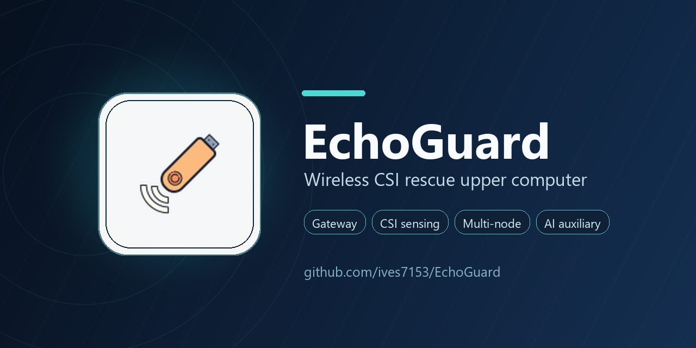

# EchoGuard

[](https://docs.espressif.com/projects/esp-idf/)
[](https://www.python.org/)
[](https://www.riverbankcomputing.com/software/pyqt/)
[](#)

基于 ESP32-S3、WiFi CSI 与 LoRa 的感传分离救援原型系统。EchoGuard 面向地震、坍塌、废墟遮挡等应急场景，用低成本节点采集 WiFi CSI 生命微动特征，经 LoRa 回传到 Gateway，再由 Windows 上位机完成可视化、规则融合和 AI 辅助研判。



## 项目简介

EchoGuard 由三部分组成：

- **Rescue Node 感知节点**：ESP32-S3 采集 WiFi CSI、SHT20 温湿度、姿态和 MQ-135 气体原始值，并通过 Ra-02/SX1278 LoRa 模块上报。
- **Gateway 汇聚网关**：ESP32-S3 接收 LoRa 帧，将节点数据转换为 JSON Lines，经 USB Serial/JTAG 输出给上位机。
- **EchoGuard 上位机**：PyQt6 桌面程序，负责串口接收、节点自动发现、实时曲线、事件流、历史导出、规则报警和 AI 辅助解释。

本项目强调“真实数据链路优先”：未收到 Gateway 串口帧前，上位机不生成假节点、不伪造历史样本；实时结论由规则融合输出，AI 只做异步辅助解释。

## 核心能力

- WiFi CSI 生命微动感知：基于 ESP32-S3 WiFi CSI 滑动窗口提取幅度扰动特征。
- LoRa 远距离回传：节点与 Gateway 使用 433 MHz、BW125、SF7、CR4/5 的 SX1278 链路。
- 多节点自动发现：上位机根据 Gateway JSON 中的 `id` 自动创建 `node{id}`。
- 多节点综合研判：最近 5 秒窗口内融合 presence、motion、confidence 和 RSSI。
- 现场安全提示：LoRa 天线、电源共地、MQ-135 分压、I2C 上拉等硬件注意事项文档化。
- MQ-135 CO2 估算 ppm：上位机将节点上报的 ADC 原始值按分压、电阻和 R0 标定参数换算为估算 ppm，支持清洁空气一键校准。
- 数据导出能力：支持 CSV 导出、CSI 曲线截图和整窗截图。
- AI 辅助研判：本地 Jina GGUF embedding 与可选大模型 API，仅用于解释和辅助，不接管实时判断。
- Windows 打包：提供 PyInstaller spec 与一键打包脚本，生成 `dist/EchoGuard/EchoGuard.exe`。

## 系统架构

```text
Rescue Node(s)
  ESP32-S3 + WiFi CSI + SHT20/MPU6050/MQ-135
        |
        | 14-byte LoRa binary frame
        v
Gateway
  ESP32-S3 + SX1278 LoRa receiver
        |
        | USB Serial/JTAG JSON Lines @ 115200
        v
EchoGuard Upper Computer
  PyQt6 UI + parser + rule fusion + export + AI helper
```

## 数据协议

节点通过 LoRa 发送 14 字节二进制帧：

```text
id:u8
seq:u32
presence:u8
motion:u8
bpm:u8
conf:u8
gas:u16
temp_x10:i16
hum:u8
```

Gateway 输出一行 JSON：

```json
{
  "id": 1,
  "seq": 0,
  "presence": 0,
  "motion": 0,
  "bpm": 0,
  "conf": 0,
  "gas": 0,
  "temp": 25.0,
  "hum": 50,
  "rssi": -80,
  "ts": 12345
}
```

上位机将字段规范化为 `node_id`、`presence_score`、`motion_score`、`confidence`、`gas_raw`、`gas_ppm`、`temperature`、`humidity`、`rssi` 等内部字段，其中 `gas` 兼容字段等同于 CO2 估算 ppm。详见 [docs/interface_alignment.md](docs/interface_alignment.md)。

## 目录结构

```text
wifi-csi-lora-rescue/
|-- docs/                    # 接口、AI、本地部署、打包说明
|-- firmware/
|   |-- gateway/              # Gateway LoRa 接收与 JSON 串口转发固件
|   +-- node/                 # Rescue Node WiFi CSI、传感器与 LoRa 上报固件
|-- hardware/                 # 接线、自检、硬件风险与接线表
|-- scripts/                  # 上位机打包与辅助脚本
|-- tests/                    # 测试与联调记录目录
|-- upper_computer/           # PyQt6 上位机源码
|-- EchoGuard.spec            # PyInstaller 打包配置
|-- partitions-8Mib.csv       # ESP32-S3 分区表
+-- README.md
```

## 硬件准备

最小演示需要：

- ESP32-S3-DevKitC-1 N8R8 开发板至少 2 块：1 块 Gateway，1 块 Rescue Node。
- Ra-02/SX1278 LoRa 模块每块板 1 个。
- 433 MHz 匹配天线，上电和发射前必须安装。
- 节点侧可接 SHT20、MPU6050、MQ-135。
- USB 数据线、杜邦线、面包板或焊接底板、稳定 5V 电源。

硬件接线请先阅读：

- [hardware/readme.md](hardware/readme.md)
- [hardware/接线表.md](hardware/%E6%8E%A5%E7%BA%BF%E8%A1%A8.md)

## 固件构建

本项目固件使用 ESP-IDF v5.3.2，目标芯片为 ESP32-S3。

确认环境：

```powershell
idf.py --version
```

构建并烧录 Gateway：

```powershell
cd firmware\gateway
idf.py set-target esp32s3
idf.py build
idf.py -p COMx flash monitor
```

构建并烧录 Rescue Node：

```powershell
cd firmware\node
idf.py set-target esp32s3
idf.py menuconfig
idf.py build
idf.py -p COMx flash monitor
```

每个实体节点烧录前，需要在 `menuconfig -> Rescue Node Configuration -> Rescue node ID` 中设置唯一编号，例如 `1 / 2 / 3 / 4`。Gateway 串口输出中的 `id` 会直接作为上位机节点编号。

## 上位机运行

推荐在仓库根目录运行：

```powershell
python -m pip install -r upper_computer\requirements.txt
python -m upper_computer.main
```

也可以进入目录后运行：

```powershell
cd upper_computer
python main.py
```

上位机启动后会自动刷新串口列表。连接 Gateway 后，收到有效 JSON Lines 时会自动发现节点并刷新仪表盘、节点管理、数据分析、历史记录和技术诊断页面。

## 打包 Windows 程序

安装打包依赖：

```powershell
python -m pip install -r requirements-build.txt
```

执行打包：

```powershell
powershell -ExecutionPolicy Bypass -File scripts\build_upper_computer.ps1
```

打包产物：

```text
dist/
+-- EchoGuard/
    +-- EchoGuard.exe
```

详细说明见 [docs/upper_computer_packaging.md](docs/upper_computer_packaging.md)。

## AI 辅助研判

AI 模块默认以规则回退为主，不影响实时判断。可选能力包括：

- 本地 Jina GGUF embedding：用于对规则融合摘要做模式相似度匹配。
- 可选大模型 API：用于生成更自然的解释文本。
- 离线包导入：适合比赛、答辩和无网现场。

模型和 llama.cpp runtime 不提交到仓库，默认放在：

```text
upper_computer/models/
upper_computer/runtime/
```

这两个目录已由 `.gitignore` 排除。部署说明见 [docs/local_jina_deployment.md](docs/local_jina_deployment.md)。

## 文档索引

- [hardware/readme.md](hardware/readme.md)：硬件接线、自检、电源与天线布局。
- [hardware/接线表.md](hardware/%E6%8E%A5%E7%BA%BF%E8%A1%A8.md)：Gateway 与 Rescue Node 接线表。
- [docs/interface_alignment.md](docs/interface_alignment.md)：固件、Gateway 与上位机协议对齐。
- [docs/ai_auxiliary_judgement.md](docs/ai_auxiliary_judgement.md)：AI 辅助研判边界与异步链路。
- [docs/ai_auxiliary_feature.md](docs/ai_auxiliary_feature.md)：AI 功能构造、原理和回退策略。
- [docs/local_jina_deployment.md](docs/local_jina_deployment.md)：本地 Jina GGUF 离线部署。
- [docs/upper_computer_packaging.md](docs/upper_computer_packaging.md)：Windows 打包流程。

## 项目阶段

- Phase 0：项目初始化与需求拆解，明确救援场景、系统边界、目录结构和原型目标。
- Phase 1：硬件接线与上电自检，完成 ESP32-S3、LoRa 与传感器基础连通。
- Phase 2：感知节点固件开发，完成 WiFi CSI 采集、传感器采集与 LoRa 上报链路。
- Phase 3：Gateway 固件开发，完成 LoRa 接收、数据汇聚与 USB 串口转发。
- Phase 4：上位机开发，完成串口接收、协议解析、数据可视化、规则判断与 AI 模块接入。
- Phase 5：系统联调与演示封装，完成遮挡场景验证、问题闭环、文档整理和展示材料准备。

## 注意事项

- Ra-02/SX1278 只能接 3.3V，禁止接 5V。
- LoRa 天线必须在上电和发射前安装。
- 所有模块必须共地。
- MQ-135 的 AO 进入 ESP32-S3 ADC 前必须确认不超过 3.3V。
- 当前 `gas` 在 Gateway JSON 中仍是 MQ-135 ADC 原始值；上位机显示的 `gas_ppm` / 兼容 `gas` 为 CO2 估算 ppm，需通过清洁空气校准提升可信度。
- 当前节点固件不上传电池电量，上位机显示为“未上报”。
- `upper_computer/models/`、`upper_computer/runtime/`、`upper_computer/exports/` 和 `dist/` 不应提交到 GitHub。
